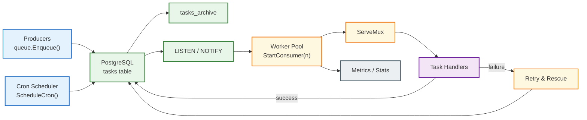

# pgqueue


[](./LICENSE)
[](#)

**pgqueue** is a lightweight, asynchronous, durable, PostgreSQL-backed job queue for Go.

It is designed to be **simple**, **safe**, and **easy to reason about**, using only PostgreSQL and standard SQL.

> ⚠️ **Project status**
> This is primarily a **learning project**, which I have created to explore how background job queues work internally.
> That aside, pgqueue aims to follow solid, production-style patterns and is suitable for real-world experimentation and small-to-medium workloads.

---

## Features

* ✅ Distributed-safe workers
* ⏱ Delayed execution
* 🔁 Automatic retries with exponential backoff + jitter
* 🚦 Job priorities
* 🧠 Deduplication support
* ⏰ Cron jobs (run once across many servers)
* 📊 Queue metrics & stats
* 🪵 Structured logging (`slog` middleware)
* 💥 Crash-resilient, at-least-once delivery

---

## Why pgqueue?

If you already use PostgreSQL, you don’t need Redis, SQS, or Kafka **just to run background jobs**.

PostgreSQL is already:

* Durable
* Transactional
* Highly available
* Operationally familiar

`pgqueue` builds a background job queue using:

* `SELECT … FOR UPDATE SKIP LOCKED`
* Advisory locking semantics
* Transactions for correctness
* `LISTEN / NOTIFY` for fast wake-ups

---

## Architecture Overview
This diagram shows how producers, PostgreSQL, workers, and cron jobs interact inside **pgqueue**.


---

## Installation

```bash
go get github.com/i-christian/pgqueue
```

---
## Setup logging
```go
logger := slog.New(
    slog.NewJSONHandler(os.Stdout, &slog.HandlerOptions{
		Level: slog.LevelInfo,
    }),
)
```

## Initilise queue with options
```go
queue, metrics, err := pgqueue.NewQueue(
    db,
    dbConnStr,
    logger,
    pgqueue.WithRescueConfig(5*time.Minute, 30*time.Minute),
		pgqueue.WithCleanupConfig(1*time.Hour, 24*time.Hour, pgqueue.ArchiveStrategy),
    // Enables cron job scheduling, 
		pgqueue.WithCronEnabled(),
  )
if err != nil {
    log.Fatalf("Failed to init queue: %v", err)

```

## Enqueue a Job

```go
type EmailPayload struct {
    Subject string `json:"subject"`
}

queue.Enqueue(
    ctx,
    "task:send:email",
    EmailPayload{Subject: "Welcome!"},
)
```

### Enqueue with Options

```go
queue.Enqueue(
    ctx,
    "task:send:email",
    payload,
    pgqueue.WithPriority(pgqueue.HighPriority),
    pgqueue.WithDelay(5*time.Minute),
    pgqueue.WithMaxRetries(10),
    pgqueue.WithDedup("email:user:123"),
)
```

Supported options include:

* Priority
* Delayed execution
* Retry limits
* Deduplication keys

---

## Start Workers (ServeMux)

`pgqueue` uses a `ServeMux` to route tasks by type, similar to `http.ServeMux`.

```go
mux := pgqueue.NewServeMux()

// Middleware runs for every task
mux.Use(pgqueue.SlogMiddleware(logger, metrics))

// Exact match
mux.HandleFunc("task:send:email", sendEmailHandler)

// Prefix match
mux.HandleFunc("task:cleanup:", cleanupHandler)
mux.HandleFunc("task:report:", reportHandler)

// Start worker pool
go queue.StartConsumer(3, mux)
```

---

## ⚠️ Bounded Task Types (Important)

Task types **must be bounded**.

### ✅ Good (bounded)

```
task:send:email
task:cleanup:expired-sessions
task:report:daily
```

### ❌ Bad (unbounded)

```
task:report:user:123
task:email:user:UUID
```

### Why this matters

* Routing is based on task type or prefix
* Metrics are keyed by task type
* Unbounded types can cause **unbounded memory growth**

**Rule of thumb:**
Use task **categories**, not per-entity identifiers.

---

## Cron Jobs

Run scheduled jobs **once**, even when multiple workers or servers are running.

```go
cronID, err := queue.ScheduleCron(
	"0 * * * *",
	"hourly-report",
	TaskReportBase+"hourly",
	ReportPayload{ReportName: "Hourly"},
)
if err != nil {
	log.Fatal(err)
}

jobs, _ := queue.ListCronJobs()
for _, job := range jobs {
	fmt.Printf(
		"Cron %d → next: %s\n",
		job.ID,
		job.NextRun.Format(time.DateTime),
	)
}

// Optional cleanup
queue.RemoveCron(cronID)
```

---

## Retries & Backoff

* At-least-once execution
* Automatic retries on failure
* Exponential backoff: `2^attempts`
* Jitter added to prevent thundering-herd effects
* Max retries configurable per job

---

## Queue Stats

```go
stats, _ := queue.Stats(ctx)

fmt.Printf(
    "Pending: %d | Processing: %d | Failed: %d | Done: %d\n",
    stats.Pending,
    stats.Processing,
    stats.Failed,
    stats.Done,
)
```

---

## Examples

A complete, runnable example demonstrating:

* Worker pools
* ServeMux routing
* slog logging
* Priorities
* Retries
* Cron jobs

➡️ **See the full example here:**
👉 [Examples](https://github.com/i-christian/pgqueue/tree/main/examples)

---

## Guarantees

pgqueue provides the following guarantees:

✔ **At-least-once execution**
✔ **No concurrent double-processing of the same task**
✔ **Safe concurrency across multiple workers and processes**
✔ **Crash resilience** (workers can die at any point)

---

## When **Not** to Use pgqueue

pgqueue is not a replacement for high-throughput message brokers.

Avoid pgqueue if you need:

* Ultra-low latency (<1ms)
* Massive fan-out (millions of jobs per second)
* Cross-region replication
* Exactly-once semantics
